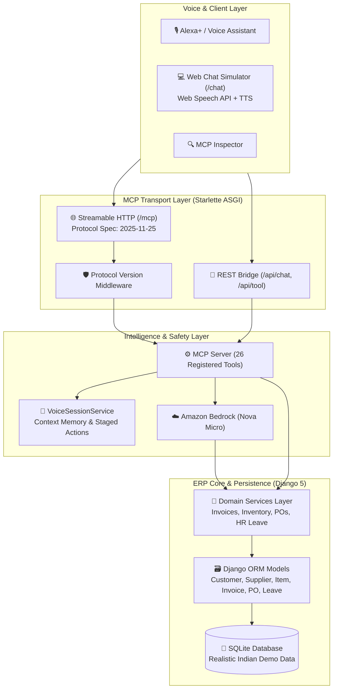

# ERP Voice Agent 🎙️🏢

> An enterprise Model Context Protocol (MCP) server that enables **Alexa+** and executive voice assistants to converse with a real-time ERP system (Invoices, Inventory, Purchase Orders, HR Leave) using natural spoken language, conversational session memory, an **Ask-Then-Confirm** action safety pattern, and autonomous **Amazon Bedrock** supply chain planning.

[](LICENSE)
[](https://www.python.org/)
[](https://modelcontextprotocol.io)
[](https://www.djangoproject.com/)
[](docs/AWS_USAGE.md)
[]()
[](django-erp-mcp/)

> [!NOTE]
> **Demo & Simulation Notice**:
> - **Simulated Alexa+ Experience**: The voice assistant interaction is simulated by the built-in **Web Chat Simulator** ([`http://127.0.0.1:8000/chat`](http://127.0.0.1:8000/chat)), utilizing the browser's native Web Speech API for voice input and `speechSynthesis` for spoken audio output.
> - **Default Mock Mode for Bedrock Planner**: For zero-cost local evaluation and automated testing without requiring AWS credentials or billable API calls, the Amazon Bedrock replenishment planner runs in deterministic mock mode by default (`AWS_MOCK_MODE=True`). To connect to live Amazon Bedrock, set `AWS_MOCK_MODE=False` in `.env` and configure valid AWS credentials.

---

## 💡 What It Does

1. **Voice-First ERP Queries**: Delivers concise, speech-friendly spoken answers formatted for text-to-speech engines (Alexa+), paired with rich structured data payloads for dashboards.
2. **Conversational Session Memory**: Remembers context across turns—allowing natural executive follow-up questions such as *"and who are the top 3 customers for that?"* or *"confirm it"*.
3. **Ask-Then-Confirm Safety Guarantee**: Never modifies mission-critical business data without explicit user confirmation. Drafts are safely staged in session memory until the user explicitly says *"Confirm it"*.
4. **AWS Builder Layer (Amazon Bedrock)**: Autonomously reasons over complex executive instructions (e.g. *"Restock everything that's running low from the fastest supplier"*), evaluates vendor lead times, and formulates replenishment purchase orders.
5. **Interactive Web Chat Simulator (`/chat`)**: Provides an interactive browser demo path featuring Web Speech API voice input, speech synthesis output, and visual cards.
6. **Reusable Standalone Adapter (`django-erp-mcp`)**: Extracted adapter package allowing **any Django application** to expose its models and actions as MCP tools with zero boilerplate.

---

## 🏛️ Architecture



---

## ⚡ Setup & Run

> **Tested Environment**: **Python 3.14.6** on Windows (Python 3.12+ compatible).

Follow these exact steps from a fresh clone:

### 1. Create & Activate Virtual Environment

**Windows (PowerShell):**
```powershell
python -m venv venv
.\venv\Scripts\Activate.ps1
```

**Linux / macOS / Bash:**
```bash
python -m venv venv
source venv/bin/activate
```

### 2. Install Dependencies

```bash
pip install -r requirements.txt
```

### 3. Configure Environment File

```powershell
# Windows PowerShell:
Copy-Item .env.example .env

# Linux / macOS / Bash:
cp .env.example .env
```

### 4. Apply Migrations & Seed Realistic Demo Data

```bash
python manage.py migrate
python manage.py seed_demo_data
```

### 5. Start the MCP Server & Web Chat Simulator

```bash
python -m mcp_server.run
```

The server starts immediately and is accessible at:
- **Web Chat Simulator**: [`http://127.0.0.1:8000/chat`](http://127.0.0.1:8000/chat) (or root [`http://127.0.0.1:8000/`](http://127.0.0.1:8000/) in any browser)
- **MCP Streamable HTTP Endpoint**: `http://127.0.0.1:8000/mcp`
- **Health Check & Spec Check**: `http://127.0.0.1:8000/health`

---

## 🎬 Hackathon Demo Script

Use this step-by-step dialogue script to showcase the full range of voice features during demos. All numbers, counts, and names below reflect the exact output generated against the freshly seeded demo dataset:

| Step | User Voice Query | Alexa+ Spoken Response | Visual Card Rendered |
| :--- | :--- | :--- | :--- |
| **1. Briefing** | *"Alexa, give me the daily ERP briefing"* | *"Namaste! Here is your daily ERP briefing. You have 20 unpaid invoices totaling 2,019,100.50 rupees. 6 items are below reorder level. 2 draft purchase orders and 8 leave requests are awaiting your review."* | Executive Summary Card with key business metrics. |
| **2. Invoices** | *"What are my pending invoices for October?"* | *"You have 11 pending invoices for October totaling 802,000.50 rupees. Top customers are Delhivery Parcel Fleet, Zomato Logistics Hub. The full list is on your screen."* | Invoices Table Card with amounts in INR and status pills. |
| **3. Context Follow-up** | *"and who are the top 3 customers for that?"* | *"For your pending invoices for October, the top 3 customers are Delhivery Parcel Fleet (182,500.00 rupees), Zomato Logistics Hub (137,500.00 rupees), Wipro Digital Solutions (125,000.50 rupees)."* | Top Customers Card utilizing session memory. |
| **4. Inventory Alert** | *"Check low stock items"* | *"There are 6 items below reorder level, including High-Pressure Hydraulic Seal 50mm, Heavy-Duty Servo Motor 2HP. The full list is on your screen."* | Low Stock Alert Card with supplier lead times. |
| **5. Bedrock Planner** | *"Restock everything that's running low from the fastest supplier"* | *"I reviewed low stock items. Reliance Industrial Polymers is the fastest supplier with a 4-day lead time. I drafted order DRAFT-PO-4 for 2 items. Would you like me to confirm it?"* | Bedrock Plan Card showing multi-step execution trace. |
| **6. Confirm Action** | *"Confirm it"* *(or click button)* | *"Purchase order DRAFT-PO-4 for Reliance Industrial Polymers has been confirmed."* | Card transitions badge to emerald **`CONFIRMED`**. |
| **7. HR Leave Approval** | *"Review pending leave requests"* &rarr; *"Approve leave for Rohan Verma"* | *"Rohan Verma has requested leave from 2026-10-10 to 2026-10-12 for 'Tax audit travel to Delhi office'. Should I confirm this approval?"* &rarr; *"Confirm it"* &rarr; *"Leave request for Rohan Verma from 2026-10-10 to 2026-10-12 has been confirmed and approved."* | Leave Card with inline **Approve** and **Reject** buttons. |

---

## 🎙️ Registered MCP Tools

The server registers **26 tools** over Model Context Protocol (MCP) supporting specification version `2025-11-25`:

### 1. Information Query & Context Tools (8 Tools)
| Tool | Arguments | Description |
| :--- | :--- | :--- |
| `get_pending_invoices` | `month` *(optional)*, `session_id` | Retrieve pending customer invoices with total count, total amount in rupees, and top 3 customers. |
| `get_overdue_invoices` | `session_id` | Retrieve all overdue customer invoices with customer names, amounts, and days overdue. |
| `get_low_stock_items` | *None* | Retrieve all inventory items currently at or below their reorder level that require supplier replenishment. |
| `get_pending_leaves` | *None* | Retrieve all employee leave requests currently pending manager review, including employee names, departments, and dates. |
| `get_sales_summary` | `period` *(`today` \| `week` \| `month`)*, `session_id` | Retrieve sales and invoice revenue summaries for today, this week, or this month. |
| `get_top_customers` | `session_id` | Follow-up tool when the user asks *"and who are the top 3 customers for that?"* using session state. |
| `get_purchase_order_status` | `session_id` | Retrieve purchase order status breakdown including counts of draft vs confirmed orders and latest recent orders. |
| `voice_daily_erp_briefing` | *None* | Provide a 30-second executive voice briefing across all ERP domains. |

### 2. Action Tools with Confirmation Step (6 Tools)
| Tool | Arguments | Ask-Then-Confirm Behavior |
| :--- | :--- | :--- |
| `draft_purchase_order` | `item_skus` *(optional)*, `session_id` | Auto-picks low stock items, groups by vendor, creates **DRAFT** POs in SQLite, returns summary + `draft_id`. Status remains `draft`. |
| `confirm_purchase_order`| `draft_id` *(optional)*, `session_id` | Transitions status to **`confirmed`**. If `draft_id` is omitted, uses the active draft from session. Fails politely if no draft exists. |
| `approve_leave` | `employee_name`, `confirm` *(bool)*, `session_id` | When `confirm=False`, checks request and asks for confirmation without altering database status. When `confirm=True`, marks status `approved`. |
| `reject_leave` | `employee_name`, `reason`, `confirm` *(bool)*, `session_id` | When `confirm=False`, asks for confirmation. When `confirm=True`, records reason and marks status `rejected`. |
| `confirm_action` | `session_id` | Universal confirmation handler when the user simply says *"confirm it"*. |
| `plan_erp_replenishment` | `prompt`, `session_id` | Amazon Bedrock autonomous multi-step replenishment planner. |

### 3. Direct Domain Management Tools (12 Tools)
| Tool | Arguments | Description |
| :--- | :--- | :--- |
| `get_unpaid_invoices` | `customer_name` *(optional)* | Query unpaid (pending or overdue) invoices with a voice-friendly spoken summary. |
| `get_invoice` | `invoice_no` | Retrieve details and status for a specific invoice. |
| `create_invoice` | `customer_name`, `amount`, `due_date`, `invoice_no`, `city` | Create a new customer invoice in the ERP system. |
| `pay_invoice` | `invoice_no` | Mark a customer invoice as paid. |
| `check_inventory_stock` | `query` *(optional)* | Check warehouse stock levels by item name or SKU. |
| `adjust_inventory_stock` | `sku`, `quantity_delta` | Adjust the physical stock count for an inventory SKU up or down. |
| `list_purchase_orders` | `status` *(optional)* | List purchase orders filtered optionally by status (`draft` or `confirmed`). |
| `create_purchase_order` | `supplier_name`, `items` | Create a new purchase order with line items. |
| `get_employee_leave_summary` | `employee_query` | Look up employee details and recent leave requests. |
| `request_leave` | `employee_name`, `from_date`, `to_date`, `reason` | Submit an employee leave request. |
| `list_pending_leave_requests` | *None* | List all pending employee leave requests awaiting manager approval. |
| `decide_leave_request` | `request_id`, `approve` *(bool)* | Approve or reject a pending leave request. |

---

## ⚡ AWS Builder Layer: Amazon Bedrock Planner

- **Amazon Bedrock Foundation Model**: Configured with `amazon.nova-micro-v1:0` (via `BEDROCK_MODEL_ID` in `.env`) for low-latency reasoning and multi-step replenishment planning.
- **Full AWS Documentation**: See [docs/AWS_USAGE.md](docs/AWS_USAGE.md) for IAM least-privilege policies, container deployment, and architectural sequence flows.

### 🔍 Honest & Transparent Planner Modes (`AWS_MOCK_MODE`)

Every response from the planner includes a transparent **`planner_mode`** field:
- **`"bedrock"`**: Live Amazon Bedrock Converse API invocation succeeded.
- **`"mock"`**: Default zero-cost mode (`AWS_MOCK_MODE=True`) executing deterministic planning simulation without calling AWS APIs.
- **`"fallback"`**: Bedrock was requested (`AWS_MOCK_MODE=False`) but failed. The server logs a clear **`WARNING`** with the error reason, attaches `fallback_reason` to the response, and uses the local planner so ERP operations never halt.

#### What is Real vs. Mocked in Default Mode (`AWS_MOCK_MODE=True`):
| Component | Status | Details |
| :--- | :---: | :--- |
| **Bedrock Foundation Model API** | **Mocked** | Simulated deterministic multi-step reasoning matching Bedrock execution trace. |
| **Inventory Database Query** | **100% Real** | Live Django ORM queries (`Item.objects.all()`) against SQLite database. |
| **Supplier Lead Time Analysis** | **100% Real** | Real calculation comparing supplier lead times from live database records. |
| **Purchase Order Creation** | **100% Real** | Creates actual draft Purchase Order records in SQLite via `draft_purchase_order()`. |
| **Session Memory & Confirmation** | **100% Real** | Staged in `VoiceSessionService` awaiting explicit spoken *"Confirm it"*. |

#### Web Chat UI Transparency:
- Results display small status badges: **`Bedrock (live)`** (emerald), **`Mock mode`** (purple), or **`Fallback`** (amber with failure reason).
- Headers and the Restock quick button **never say "Bedrock"** unless the active mode is live.

---

## 🔌 Reusable Standalone Package: `django-erp-mcp`

The reusable core of this project has been extracted into a standalone Python package located at [`django-erp-mcp/`](django-erp-mcp/):

- **What it is**: An adapter allowing any Django app to expose its models and actions as MCP tools with speech summaries and confirmation guards.
- **Includes**: Its own `pyproject.toml`, MIT `LICENSE`, `README.md`, `example/`, and unit test suite.
- **Quick Example**:
  ```python
  from mcp.server.mcpserver import MCPServer
  from django_erp_mcp import DjangoMCPRegistry
  from myapp.models import Invoice

  mcp_server = MCPServer("my-django-mcp")
  registry = DjangoMCPRegistry(mcp_server)
  registry.register_model(
      model=Invoice,
      read_fields=["invoice_no", "amount", "status"],
      search_fields=["invoice_no", "customer__name"],
      voice_formatter=lambda invs: f"Found {len(invs)} invoices totaling ₹{sum(i.amount for i in invs):,.2f}.",
  )
  ```

---

## 🧪 Running Tests

Run the complete test suite across all 13 test suites with pytest:

```bash
python -m pytest -v
```

All **82 tests** validate:
- **Models**: `Customer`, `Supplier`, `Item`, `Invoice`, `PurchaseOrder`, `PurchaseOrderLine`, `Employee`, `LeaveRequest` (`tests/test_models.py`: **7 tests**)
- **Data Seeding**: Realistic Indian demo data counts & idempotency (`tests/test_seed_command.py`: **2 tests**)
- **Invoices**: Unpaid counts/totals, customer filtering, details, creation, validation, marking paid (`tests/test_invoices.py`: **6 tests**)
- **Inventory**: Stock lookup, SKU search, low stock alert calculation, stock increment/decrement, negative stock prevention (`tests/test_inventory.py`: **5 tests**)
- **Purchase Orders**: Listing by status, draft creation, confirmation, non-existent PO handling (`tests/test_purchase_orders.py`: **4 tests**)
- **HR Leave Management**: Employee leave summary, request submission, pending listing, approval/rejection decisioning (`tests/test_hr_leave.py`: **5 tests**)
- **MCP Protocol Compliance**: Streamable HTTP endpoint, specification version `2025-11-25`, header negotiation, health check, registered tools (`tests/test_mcp_protocol.py`: **5 tests**)
- **Voice MCP Tools**: Speech-friendly responses for pending invoices, overdue invoices, low stock items, pending leaves, sales summaries, and PO status (`tests/test_voice_mcp_tools.py`: **7 tests**)
- **Voice Briefing & Async Domain Tools**: Executive morning briefing service and async MCP domain tools (`tests/test_voice_tools.py`: **3 tests**)
- **Action Confirmation & Safety**: Draft-only creation, explicit confirmation, polite failure without draft, leave confirmation, session isolation (`tests/test_action_confirmation.py`: **8 tests**)
- **AWS Bedrock Planner**: Environment config, fastest supplier optimization, multi-step plan generation, confirm-it flow, and all 3 planner modes (mock, bedrock live, fallback error handling) (`tests/test_aws_planner.py`: **8 tests**)
- **Web Chat Simulator**: HTML page serving, browser root routing, voice API endpoints, direct tool execution, transparent mode labels, explicit intent routing & polite fallback (`tests/test_web_chat.py`: **18 tests**)
- **Standalone Package (`django-erp-mcp`)**: Model serialization, querying, tool registration, `@mcp_model` decorator (`django-erp-mcp/tests/test_adapter.py`: **4 tests**)
- **Total**: **82 passed in ~13 seconds** (7 + 2 + 6 + 5 + 4 + 5 + 5 + 7 + 3 + 8 + 8 + 18 + 4 = 82).

---

## 🔍 Testing with the MCP Inspector

Test tool calls interactively with the official [MCP Inspector](https://github.com/modelcontextprotocol/inspector):

### Step 1: Start the MCP Server
```powershell
python -m mcp_server.run
```

### Step 2: Launch the MCP Inspector
In a separate terminal window:
```powershell
npx @modelcontextprotocol/inspector
```

> [!TIP]
> **PowerShell Execution Policy Error**:
> If you encounter `File ... cannot be loaded because running scripts is disabled on this system` when running `npx` in Windows PowerShell, bypass the policy for that session by running:
> ```powershell
> Set-ExecutionPolicy -Scope Process -ExecutionPolicy Bypass
> ```

### Step 3: Connect
1. In the Inspector web interface that opens in your browser, select **Streamable HTTP** as the transport type.
2. Enter the server URL:
   ```text
   http://127.0.0.1:8000/mcp
   ```
3. Click **Connect**.
4. Explore all 26 registered tools under the **Tools** tab, run queries, and verify both spoken summaries (`speech`) and structured payloads (`data`).

---

## 📚 Documentation Links

- [docs/AWS_USAGE.md](docs/AWS_USAGE.md): Complete AWS cloud services documentation, architecture, and Bedrock justifications.
- [docs/FRICTION_LOG.md](docs/FRICTION_LOG.md): Developer friction log, framework limitations, workarounds, and upstream suggestions.
- [django-erp-mcp/README.md](django-erp-mcp/README.md): Standalone package documentation and quickstart guide.
- [CHANGELOG.md](CHANGELOG.md): Version history adhering to Keep a Changelog.
- [LICENSE](LICENSE): MIT License.
