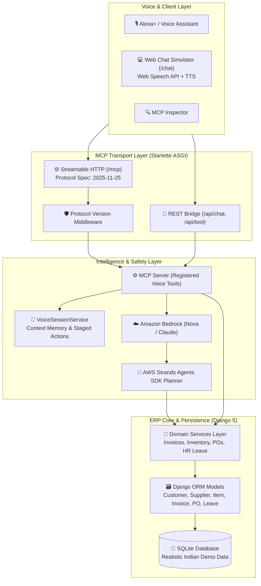

# ERP Voice Agent 🎙️🏢

> An enterprise Model Context Protocol (MCP) server that enables **Alexa+** and executive voice assistants to converse with a real-time ERP system (Invoices, Inventory, Purchase Orders, HR Leave) using natural spoken language, conversational session memory, an **Ask-Then-Confirm** action safety pattern, and autonomous **Amazon Bedrock** supply chain planning.

[](LICENSE)
[](https://modelcontextprotocol.io)
[](https://www.djangoproject.com/)
[](docs/AWS_USAGE.md)
[]()
[](django-erp-mcp/)

---

## 💡 What It Does

1. **Voice-First ERP Queries**: Delivers concise, speech-friendly spoken answers formatted for text-to-speech engines (Alexa+), paired with rich structured data payloads for dashboards.
2. **Conversational Session Memory**: Remembers context across turns—allowing natural executive follow-up questions such as *"and who are the top 3 customers for that?"* or *"confirm it"*.
3. **Ask-Then-Confirm Safety Guarantee**: Never modifies mission-critical business data without explicit user confirmation. Drafts are safely staged in session memory until the user explicitly says *"Confirm it"*.
4. **AWS Builder Layer (Amazon Bedrock & Strands Agents SDK)**: Autonomously reasons over complex executive instructions (e.g. *"Restock everything that's running low from the fastest supplier"*), evaluates vendor lead times, and formulates replenishment purchase orders.
5. **Interactive Web Chat Simulator (`/chat`)**: Provides a fallback demo path featuring browser Web Speech API voice input, speech synthesis output, and interactive cards.
6. **Reusable Standalone Adapter (`django-erp-mcp`)**: Extracted adapter package allowing **any Django application** to expose its models and actions as MCP tools with zero boilerplate.

---

## 🏛️ Architecture



---

## ⚡ Setup & Run (Under 5 Commands)

Get up and running locally in **4 simple commands**:

```bash
# 1. Install dependencies
pip install -r requirements.txt

# 2. Configure environment
cp .env.example .env

# 3. Apply migrations & seed realistic Indian demo data
python manage.py migrate && python manage.py seed_demo_data

# 4. Start the MCP Streamable HTTP server
python -m mcp_server.run
```

The server is immediately available at:
- **Web Chat Simulator**: [`http://127.0.0.1:8000/chat`](http://127.0.0.1:8000/chat) (or simply [`http://127.0.0.1:8000/`](http://127.0.0.1:8000/) in any browser)
- **MCP Streamable HTTP Endpoint**: `http://127.0.0.1:8000/mcp`
- **Health Check & Spec Check**: `http://127.0.0.1:8000/health`

---

## 🎬 Hackathon Demo Script

Use this step-by-step dialogue script to showcase the full range of voice features during demos:

| Step | User Voice Query | Alexa+ Spoken Response | Visual Card Rendered |
| :--- | :--- | :--- | :--- |
| **1. Briefing** | *"Alexa, give me the daily ERP briefing"* | *"Namaste! You have 18 unpaid invoices totaling 31,15,000 rupees. 7 items are below reorder level. 8 leave requests are awaiting your review."* | Executive Summary Card with key business metrics. |
| **2. Invoices** | *"What are my pending invoices for October?"* | *"You have 10 pending invoices totaling 18 lakh 75 thousand rupees. Top customers are Tata Motors, Infosys, and Reliance."* | Invoices Table Card with amounts in INR and status pills. |
| **3. Context Follow-up** | *"and who are the top 3 customers for that?"* | *"For your pending invoices for October, the top 3 customers are Tata Motors (₹7,50,000), Infosys (₹6,20,000), and Reliance (₹5,05,000)."* | Top Customers Card utilizing session memory. |
| **4. Inventory Alert** | *"Check low stock items"* | *"There are 7 items below reorder level, including Copper Wire 2.5mm and Steel Fasteners M8. Restocking is recommended."* | Low Stock Alert Card with supplier lead times. |
| **5. Bedrock Planner** | *"Restock everything that's running low from the fastest supplier"* | *"I reviewed low stock items. Reliance Industrial Polymers is the fastest supplier with a 3-day lead time. I drafted order DRAFT-PO-11 for 3 items. Would you like me to confirm it?"* | Bedrock Plan Card showing multi-step execution trace. |
| **6. Confirm Action** | *"Confirm it"* *(or click button)* | *"Purchase order DRAFT-PO-11 for Reliance Industrial Polymers has been confirmed."* | Card transitions badge to emerald **`CONFIRMED`**. |
| **7. HR Leave Approval** | *"Review pending leave requests"* &rarr; *"Approve leave for Rajesh Sharma"* | *"Rajesh Sharma has requested leave from 2026-10-10 to 2026-10-12 for 'Personal work'. Should I confirm this approval?"* &rarr; *"Confirm it"* &rarr; *"Leave request confirmed and approved."* | Leave Card with inline **Approve** and **Reject** buttons. |

---

## 🎙️ Alexa+ Voice & Action MCP Tools

The server registers 11 primary tools over Model Context Protocol (MCP) supporting specification version `2025-11-25`:

### 1. Information Query & Context Tools
| Tool | Arguments | Description |
| :--- | :--- | :--- |
| `get_pending_invoices` | `month` *(optional)*, `session_id` | Count, total amount in INR, and top 3 customers. Stores context in session state. |
| `get_overdue_invoices` | `session_id` | Overdue invoices with customer names, amounts, and days overdue. |
| `get_low_stock_items` | *None* | Inventory items below reorder level with current stock and supplier lead times. |
| `get_pending_leaves` | *None* | Pending employee leave requests with employee names, departments, and date ranges. |
| `get_sales_summary` | `period` *(`today` \| `week` \| `month`)*, `session_id` | Revenue collected, paid invoice count, and average invoice size. |
| `get_top_customers` | `session_id` | Follow-up query answering *"and who are the top 3 customers for that?"* using session state. |
| `voice_daily_erp_briefing` | *None* | 30-second cross-domain morning executive briefing for Alexa+. |

### 2. Action Tools with Confirmation Step
| Tool | Arguments | Ask-Then-Confirm Behavior |
| :--- | :--- | :--- |
| `draft_purchase_order` | `item_skus` *(optional)*, `session_id` | Auto-picks low stock items, groups by vendor, creates **DRAFT** POs in SQLite, returns summary + `draft_id`. Status remains `draft`. |
| `confirm_purchase_order`| `draft_id` *(optional)*, `session_id` | Transitions status to **`confirmed`**. If `draft_id` is omitted, uses the active draft from session. Fails politely if no draft exists. |
| `approve_leave` | `employee_name`, `confirm` *(bool)*, `session_id` | When `confirm=False`, checks request and asks for confirmation without altering database status. When `confirm=True`, marks status `approved`. |
| `reject_leave` | `employee_name`, `reason`, `confirm` *(bool)*, `session_id` | When `confirm=False`, asks for confirmation. When `confirm=True`, records reason and marks status `rejected`. |
| `confirm_action` | `session_id` | Universal voice handler for conversational *"confirm it"* queries. |
| `plan_erp_replenishment` | `prompt`, `session_id` | Amazon Bedrock & Strands autonomous multi-step replenishment planner. |

---

## ⚡ AWS Builder Layer: Amazon Bedrock & Strands Agents

- **Amazon Bedrock Foundation Models**: Uses `amazon.nova-micro-v1:0` for fast voice inference or `anthropic.claude-3-5-sonnet-20241022-v2:0` for multi-step reasoning.
- **AWS Strands Agents SDK**: Orchestrates tool definitions, multi-step goal decomposition, and confirmation enforcement.
- **Full AWS Documentation**: See [docs/AWS_USAGE.md](docs/AWS_USAGE.md) for IAM least-privilege policies, container deployment, and architectural sequence flows.

### 🔍 Honest & Transparent Planner Modes (`AWS_MOCK_MODE`)

Every response from the planner includes a transparent **`planner_mode`** field:
- **`"bedrock"`**: Live Amazon Bedrock Converse API invocation succeeded.
- **`"mock"`**: Default zero-cost mode (`AWS_MOCK_MODE=True`) executing deterministic planning simulation without calling AWS APIs.
- **`"fallback"`**: Bedrock was requested (`AWS_MOCK_MODE=False`) but failed. The server logs a clear **`WARNING`** with the error reason, attaches `fallback_reason` to the response, and uses the local planner so ERP operations never halt.

#### What is Real vs. Mocked in Default Mode (`AWS_MOCK_MODE=True`):
| Component | Status | Details |
| :--- | :---: | :--- |
| **Bedrock Foundation Model API** | **Mocked** | Simulated deterministic multi-step reasoning matching Bedrock execution trace. |
| **Inventory Database Query** | **100% Real** | Live Django ORM queries (`Item.objects.all()`) against SQLite database. |
| **Supplier Lead Time Analysis** | **100% Real** | Real calculation comparing supplier lead times from live database records. |
| **Purchase Order Creation** | **100% Real** | Creates actual draft Purchase Order records in SQLite via `draft_purchase_order()`. |
| **Session Memory & Confirmation** | **100% Real** | Staged in `VoiceSessionService` awaiting explicit spoken *"Confirm it"*. |

#### Web Chat UI Transparency:
- Results display small status badges: **`Bedrock (live)`** (emerald), **`Mock mode`** (purple), or **`Fallback`** (amber with failure reason).
- Headers and the Restock quick button **never say "Bedrock"** unless the active mode is live.

## 🔌 Reusable Standalone Package: `django-erp-mcp`

The reusable core of this project has been extracted into a standalone Python package located at [`django-erp-mcp/`](django-erp-mcp/):

- **What it is**: An adapter allowing any Django app to expose its models and actions as MCP tools with speech summaries and confirmation guards.
- **Includes**: Its own `pyproject.toml`, MIT `LICENSE`, `README.md`, `example/`, and unit test suite.
- **Quick Example**:
  ```python
  from mcp.server.mcpserver import MCPServer
  from django_erp_mcp import DjangoMCPRegistry
  from myapp.models import Invoice

  mcp_server = MCPServer("my-django-mcp")
  registry = DjangoMCPRegistry(mcp_server)
  registry.register_model(
      model=Invoice,
      read_fields=["invoice_no", "amount", "status"],
      search_fields=["invoice_no", "customer__name"],
      voice_formatter=lambda invs: f"Found {len(invs)} invoices totaling ₹{sum(i.amount for i in invs):,.2f}.",
  )
  ```

---

## 🧪 Running Tests

Run the complete test suite across all 13 test suites with pytest:

```bash
python -m pytest -v
```

All **65 tests** validate:
- **Models**: Customer, Supplier, Item, Invoice, PurchaseOrder, PurchaseOrderLine, Employee, LeaveRequest (7 tests)
- **Data Seeding**: Realistic Indian demo data counts & idempotency (2 tests)
- **Domain Services**: Invoices, Inventory, POs, HR Leave, Daily Voice Briefing (17 tests)
- **MCP Protocol**: Streamable HTTP, header negotiation, health check, registered tools (6 tests)
- **Voice Tools**: Invoices, overdue, low stock, leaves, sales summary (6 tests)
- **Action Confirmation**: Draft-only creation, explicit confirmation, polite failure without draft, leave confirmation, session isolation (8 tests)
- **AWS Bedrock Planner**: Environment config, fastest supplier optimization, multi-step plan generation, confirm-it flow, and all 3 planner modes (mock, bedrock live, fallback error handling) (8 tests)
- **Web Chat Simulator**: HTML page serving, browser root routing, voice API endpoints, direct tool execution, transparent mode labels (7 tests)
- **Standalone Package**: Model serialization, querying, tool registration, `@mcp_model` decorator (4 tests)
- **Total**: **70 passed in ~18 seconds**.

---

## 🔍 Testing with the MCP Inspector

Test tool calls interactively with the official [MCP Inspector](https://github.com/modelcontextprotocol/inspector):

```bash
# Terminal 1: Start the MCP Server
python -m mcp_server.run

# Terminal 2: Connect MCP Inspector to Streamable HTTP
npx @modelcontextprotocol/inspector http://127.0.0.1:8000/mcp
```

1. Select **Streamable HTTP** as the transport type.
2. Verify all registered tools appear under the **Tools** tab.
3. Test tool executions and inspect both `speech` and `data` outputs.

---

## 📚 Documentation Links

- [docs/AWS_USAGE.md](docs/AWS_USAGE.md): Complete AWS cloud services documentation, architecture, and Bedrock justifications.
- [docs/FRICTION_LOG.md](docs/FRICTION_LOG.md): Developer friction log, framework limitations, workarounds, and upstream suggestions.
- [django-erp-mcp/README.md](django-erp-mcp/README.md): Standalone package documentation and quickstart guide.
- [CHANGELOG.md](CHANGELOG.md): Version history adhering to Keep a Changelog.
- [LICENSE](LICENSE): MIT License.
