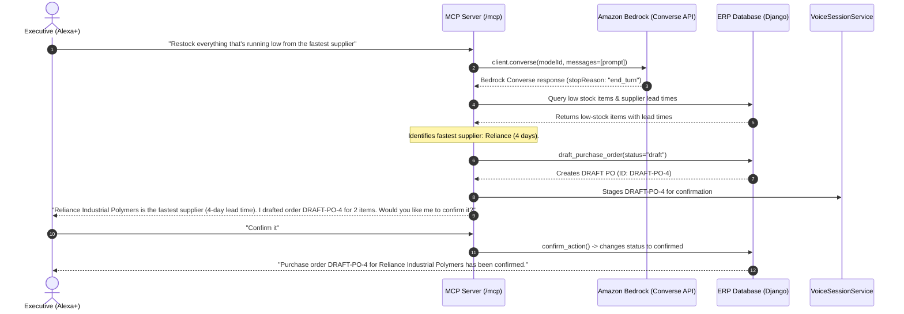

# AWS Usage & Architecture: ERP Voice Agent ☁️🎙️

> **AWS Builder Challenge Submission**: Technical documentation of the Amazon Bedrock integration and live foundation model invocation powering the **ERP Voice Agent**.

---

## 🏗️ 1. Architecture Overview

The **ERP Voice Agent** integrates **Amazon Bedrock** Foundation Models with an enterprise Model Context Protocol (MCP) server over Streamable HTTP, enabling **Alexa+** and executive voice assistants to reason across ERP supply chain operations safely.

```text
                               ┌──────────────────────────────────────────────────┐
                               │                    Alexa+ /                      │
                               │                Voice Assistant                   │
                               └─────────────────────────┬────────────────────────┘
                                                         │ Voice Query
                                                         ▼
                               ┌──────────────────────────────────────────────────┐
                               │           MCP Server (Streamable HTTP)           │
                               │           ASGI Mounted at /mcp (Spec 2025-11-25) │
                               └─────────────────────────┬────────────────────────┘
                                                         │
                                    ┌────────────────────┴────────────────────┐
                                    ▼                                         ▼
                     ┌─────────────────────────────┐           ┌─────────────────────────────┐
                     │   Standard Voice MCP Tools  │           │   AWS Builder Layer:        │
                     │  - Invoices, Stock, Leaves  │           │   Amazon Bedrock            │
                     │  - Ask-Then-Confirm Actions │           │   ERP Planner Agent         │
                     └──────────────┬──────────────┘           └──────────────┬──────────────┘
                                    │                                         │
                                    │ Multi-Step Planning & Tool Invocations  │
                                    └────────────────────┬────────────────────┘
                                                         │
                                                         ▼
                               ┌──────────────────────────────────────────────────┐
                               │                  ERP Core Layer                  │
                               │           Django 5 + SQLite Database             │
                               │  - Customers, Suppliers, Items, Invoices, POs    │
                               └──────────────────────────────────────────────────┘
```

---

## ☁️ 2. AWS Services Used & Justification

The codebase interacts directly with **Amazon Bedrock** via the AWS SDK for Python (`boto3`).

### Amazon Bedrock (`bedrock-runtime`)
- **API Utilized**: `client.converse(...)` (Bedrock Converse API)
- **Model Utilized**: `amazon.nova-micro-v1:0` (configured via `BEDROCK_MODEL_ID` in `.env`, with cross-region inference profiles such as `us.amazon.nova-micro-v1:0` supported)
- **Authentication**:
  - `AWS_BEARER_TOKEN_BEDROCK`: Bedrock API Key / Bearer token (picked up automatically by `boto3`).
  - Standard AWS credentials (`AWS_ACCESS_KEY_ID`, `AWS_SECRET_ACCESS_KEY`, `AWS_SESSION_TOKEN`) or IAM execution roles.
  - **Zero Key Logging**: Bearer tokens and credentials are never printed or logged.
- **Why Bedrock**:
  1. **Serverless Foundation Models**: Zero GPU provisioning or server maintenance.
  2. **Low-Latency Converse API**: Structured request/response schema designed for conversational voice latency.
  3. **Enterprise Privacy**: ERP data (invoices, client records, purchase orders) is never retained or used for foundation model training.
  4. **Strict Safety Alignment**: Adheres to the ERP confirmation principle so orders strictly remain in `draft` state until user confirmation.

---

## 🎯 3. What the Live Call Does

When `AWS_MOCK_MODE=False` and an executive speaks a replenishment request such as:
> *"Restock everything that's running low from the fastest supplier"*

The agent executes a live Converse call:

1. **Client Initialization**: Initializes `boto3.client("bedrock-runtime", region_name=AWSConfig.get_region())`.
2. **Converse Invocation**:
   ```python
   response = client.converse(
       modelId=AWSConfig.get_model_id(),
       system=[{"text": "You are an ERP Supply Chain Planner Agent. You analyze warehouse stock, optimize supplier lead times, and formulate replenishment purchase order plans. Always adhere to the confirmation principle: never confirm without user approval."}],
       messages=[{"role": "user", "content": [{"text": prompt}]}],
       inferenceConfig={"temperature": 0.2, "maxTokens": 500},
   )
   ```
3. **Structured Plan Formulation**:
   - Queries inventory to identify items at or below reorder levels.
   - Evaluates suppliers to pick the fastest vendor by lead time.
   - Creates real draft purchase orders (`DRAFT-PO-4`) in SQLite via `VoiceERPToolsService.draft_purchase_order()`.
   - Records Bedrock response metadata (`bedrock_response_status: response["stopReason"]`).
4. **Transparent Badge & UI**:
   - Sets `planner_mode: "bedrock"`.
   - The Web Chat UI renders the emerald **`Bedrock (live)`** badge.



---

## 🧪 4. Transparent Planner Modes (`AWS_MOCK_MODE`)

Every response from `plan_erp_replenishment` / `ERPPlannerAgent` includes an explicit **`planner_mode`** field:

| Mode | Trigger Condition | Behavior & Guarantees | Web Chat Badge |
| :--- | :--- | :--- | :---: |
| **`"bedrock"`** | `AWS_MOCK_MODE=False` and Bedrock Converse API succeeds | Live Amazon Bedrock call reasons over the request and formulates replenishment steps. | `<span class="pill pill-confirmed">Bedrock (live)</span>` (Emerald) |
| **`"mock"`** | `AWS_MOCK_MODE=True` (Default) | Zero-cost deterministic multi-step simulation executing identical reasoning and tool chains without calling AWS APIs. Default for automated test suites. | `<span class="pill pill-draft">Mock mode</span>` (Purple) |
| **`"fallback"`** | `AWS_MOCK_MODE=False` but Bedrock call fails (credentials, SCP deny, quota) | Emits a clear **`WARNING`** log with the exact exception reason, attaches `fallback_reason` to the response, and falls back gracefully to deterministic planning. | `<span class="pill pill-overdue">Fallback</span>` (Amber) |

---

## 🔧 5. Live Connectivity Check Command

To verify your Amazon Bedrock credentials and connectivity without starting the full web server:

```powershell
python -m aws_planner.check
```

This makes ONE lightweight Converse call (`"Say hello in one short sentence."`) and outputs:
- **AWS Region & Model ID**
- **Authentication Method** (Bearer token or IAM, secrets masked)
- **Call Latency** and **Bedrock reply**
- If an error mentions that the model requires an inference profile, it outputs the exact profile ID to set in `.env` (e.g. `BEDROCK_MODEL_ID=us.amazon.nova-micro-v1:0`).
