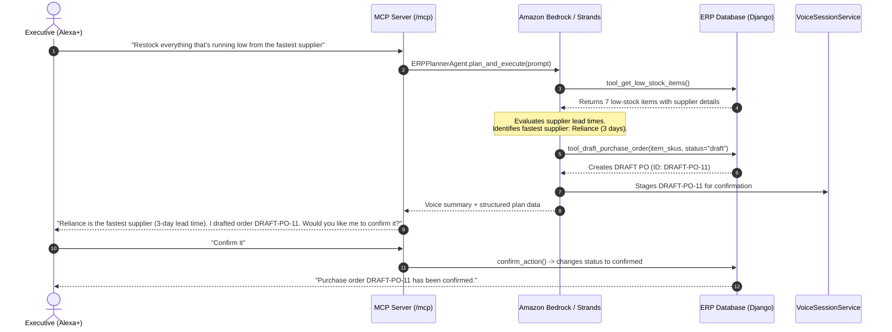

# AWS Usage & Architecture: ERP Voice Agent ☁️🎙️

> **AWS Builder Challenge Submission**: Comprehensive documentation of AWS cloud services, architectural roles, and design decisions powering the **ERP Voice Agent**.

---

## 🏗️ 1. Architecture Overview

The **ERP Voice Agent** integrates **Amazon Bedrock** and the **AWS Strands Agents SDK** with an enterprise Model Context Protocol (MCP) server over Streamable HTTP, enabling **Alexa+** and executive voice assistants to reason across ERP supply chain operations safely.

```text
                               ┌──────────────────────────────────────────────────┐
                               │                    Alexa+ /                      │
                               │                Voice Assistant                   │
                               └─────────────────────────┬────────────────────────┘
                                                         │ Voice Query
                                                         ▼
                               ┌──────────────────────────────────────────────────┐
                               │           MCP Server (Streamable HTTP)           │
                               │           ASGI Mounted at /mcp (Spec 2025-11-25) │
                               └─────────────────────────┬────────────────────────┘
                                                         │
                                    ┌────────────────────┴────────────────────┐
                                    ▼                                         ▼
                     ┌─────────────────────────────┐           ┌─────────────────────────────┐
                     │   Standard Voice MCP Tools  │           │   AWS Builder Layer:        │
                     │  - Invoices, Stock, Leaves  │           │   Amazon Bedrock & Strands  │
                     │  - Ask-Then-Confirm Actions │           │   ERP Planner Agent         │
                     └──────────────┬──────────────┘           └──────────────┬──────────────┘
                                    │                                         │
                                    │ Multi-Step Planning & Tool Invocations  │
                                    └────────────────────┬────────────────────┘
                                                         │
                                                         ▼
                               ┌──────────────────────────────────────────────────┐
                               │                  ERP Core Layer                  │
                               │           Django 5 + SQLite Database             │
                               │  - Customers, Suppliers, Items, Invoices, POs    │
                               └──────────────────────────────────────────────────┘
```

---

## ☁️ 2. AWS Services Used & Justification

### 1. Amazon Bedrock
- **Role**: Foundation Model Orchestration & Natural Language Reasoning Engine.
- **Models Utilized**:
  - `amazon.nova-micro-v1:0` (Fast, cost-efficient Amazon Nova model for real-time voice latency)
  - `anthropic.claude-3-5-sonnet-20241022-v2:0` (Advanced multi-step reasoning and supplier optimization)
- **Why Bedrock**:
  1. **Serverless Generative AI**: Zero GPU provisioning or infrastructure management.
  2. **Low-Latency Converse API**: Delivers the near-instantaneous responses essential for natural Alexa+ voice interactions.
  3. **Enterprise Data Privacy**: Ensures proprietary business ERP data (invoices, client records, purchase orders) is never used for foundation model training.
  4. **Native Tool Use**: Seamlessly invokes Python functions as tools to inspect stock levels, compare supplier lead times, and generate purchase orders.

### 2. AWS Strands Agents SDK (`strands-agents`)
- **Role**: Official AWS Multi-Agent Framework and Tool Orchestration Layer.
- **Why Strands Agents SDK**:
  1. **First-Class Bedrock Integration**: Built natively around `BedrockModel` with automatic schema generation for Python functions.
  2. **Multi-Step Goal Decomposition**: Transforms vague executive directives (e.g., *"Restock everything running low from the fastest supplier"*) into structured, verifiable execution sequences.
  3. **Safety & Confirmation Enforcement**: Embeds the critical ERP safety constraint that draft orders are staged in session memory and **never committed to the database without explicit user confirmation**.

### 3. AWS App Runner / Amazon ECS (Container Hosting)
- **Role**: Scalable, fully-managed hosting for the Model Context Protocol (MCP) server.
- **Why App Runner / ECS**:
  1. Direct support for streaming ASGI HTTP servers (`Streamable HTTP` on `/mcp`).
  2. Automatic horizontal scaling in response to concurrent voice queries.
  3. Seamless integration with AWS VPC, AWS Secrets Manager, and IAM Roles.

### 4. AWS Identity and Access Management (IAM)
- **Role**: Least-Privilege Role-Based Access Control (RBAC).
- **Policy Definition**:
  ```json
  {
    "Version": "2012-10-17",
    "Statement": [
      {
        "Effect": "Allow",
        "Action": [
          "bedrock:InvokeModel",
          "bedrock:Converse"
        ],
        "Resource": [
          "arn:aws:bedrock:*::foundation-model/amazon.nova-micro-v1:0",
          "arn:aws:bedrock:*::foundation-model/anthropic.claude-3-5-sonnet-20241022-v2:0"
        ]
      }
    ]
  }
  ```
- **Security Rule**: Zero hardcoded credentials. Reads region and model ID from environment variables, leveraging standard AWS credential providers (IAM Roles, AWS CLI profiles, or environment variables).

---

## 🎯 3. The "ERP Planner Agent" Workflow

When an executive speaks an instruction such as:
> *"Restock everything that's running low from the fastest supplier"*

The **ERP Planner Agent** executes a multi-step plan:



---

## 🧪 4. Zero-Cost Mock Mode (`AWS_MOCK_MODE`)

To ensure that hackathon evaluators, CI/CD automated test suites, and local demos can run **without incurring AWS charges or requiring active AWS credentials**, the application includes a full **Mock Mode**:

### Configuration in `.env`:
```ini
# Set to True for zero-cost local demo & pytest suites
AWS_MOCK_MODE=True

# AWS Region & Model configuration
AWS_REGION=us-east-1
BEDROCK_MODEL_ID=amazon.nova-micro-v1:0
```

### Transition to Live AWS:
To run against real Amazon Bedrock:
1. Set `AWS_MOCK_MODE=False` in `.env`.
2. Configure AWS credentials via `aws configure` or set `AWS_ACCESS_KEY_ID` and `AWS_SECRET_ACCESS_KEY`.
3. The server automatically routes requests to Bedrock's Converse API.
