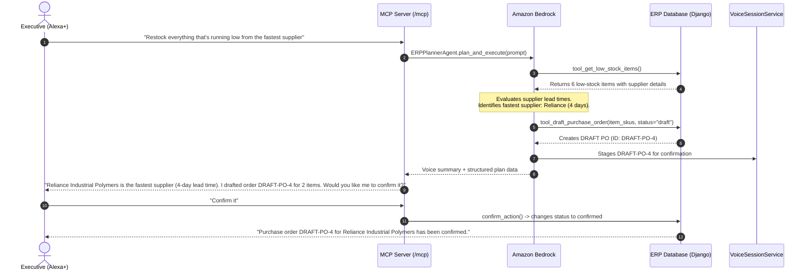

# AWS Usage & Architecture: ERP Voice Agent ☁️🎙️

> **AWS Builder Challenge Submission**: Comprehensive documentation of AWS cloud services, architectural roles, and design decisions powering the **ERP Voice Agent**.

---

## 🏗️ 1. Architecture Overview

The **ERP Voice Agent** integrates **Amazon Bedrock** Foundation Models with an enterprise Model Context Protocol (MCP) server over Streamable HTTP, enabling **Alexa+** and executive voice assistants to reason across ERP supply chain operations safely.

```text
                               ┌──────────────────────────────────────────────────┐
                               │                    Alexa+ /                      │
                               │                Voice Assistant                   │
                               └─────────────────────────┬────────────────────────┘
                                                         │ Voice Query
                                                         ▼
                               ┌──────────────────────────────────────────────────┐
                               │           MCP Server (Streamable HTTP)           │
                               │           ASGI Mounted at /mcp (Spec 2025-11-25) │
                               └─────────────────────────┬────────────────────────┘
                                                         │
                                    ┌────────────────────┴────────────────────┐
                                    ▼                                         ▼
                     ┌─────────────────────────────┐           ┌─────────────────────────────┐
                     │   Standard Voice MCP Tools  │           │   AWS Builder Layer:        │
                     │  - Invoices, Stock, Leaves  │           │   Amazon Bedrock            │
                     │  - Ask-Then-Confirm Actions │           │   ERP Planner Agent         │
                     └──────────────┬──────────────┘           └──────────────┬──────────────┘
                                    │                                         │
                                    │ Multi-Step Planning & Tool Invocations  │
                                    └────────────────────┬────────────────────┘
                                                         │
                                                         ▼
                               ┌──────────────────────────────────────────────────┐
                               │                  ERP Core Layer                  │
                               │           Django 5 + SQLite Database             │
                               │  - Customers, Suppliers, Items, Invoices, POs    │
                               └──────────────────────────────────────────────────┘
```

---

## ☁️ 2. AWS Services Used & Justification

### 1. Amazon Bedrock
- **Role**: Foundation Model Orchestration & Natural Language Reasoning Engine.
- **Model Utilized**:
  - `amazon.nova-micro-v1:0` (Fast, cost-efficient Amazon Nova model for real-time voice latency and multi-step reasoning, configurable via `BEDROCK_MODEL_ID` in `.env`)
- **Why Bedrock**:
  1. **Serverless Generative AI**: Zero GPU provisioning or infrastructure management.
  2. **Low-Latency Converse API**: Delivers the near-instantaneous responses essential for natural Alexa+ voice interactions.
  3. **Enterprise Data Privacy**: Ensures proprietary business ERP data (invoices, client records, purchase orders) is never used for foundation model training.
  4. **Native Tool Use**: Seamlessly invokes Python functions as tools to inspect stock levels, compare supplier lead times, and generate purchase orders.

### 2. AWS App Runner / Amazon ECS (Container Hosting)
- **Role**: Scalable, fully-managed hosting for the Model Context Protocol (MCP) server.
- **Why App Runner / ECS**:
  1. Direct support for streaming ASGI HTTP servers (`Streamable HTTP` on `/mcp`).
  2. Automatic horizontal scaling in response to concurrent voice queries.
  3. Seamless integration with AWS VPC, AWS Secrets Manager, and IAM Roles.

### 3. AWS Identity and Access Management (IAM)
- **Role**: Least-Privilege Role-Based Access Control (RBAC).
- **Policy Definition**:
  ```json
  {
    "Version": "2012-10-17",
    "Statement": [
      {
        "Effect": "Allow",
        "Action": [
          "bedrock:InvokeModel",
          "bedrock:Converse"
        ],
        "Resource": [
          "arn:aws:bedrock:*::foundation-model/amazon.nova-micro-v1:0"
        ]
      }
    ]
  }
  ```
- **Security Rule**: Zero hardcoded credentials. Reads region and model ID from environment variables, leveraging standard AWS credential providers (IAM Roles, AWS CLI profiles, or environment variables).

---

## 🎯 3. The "ERP Planner Agent" Workflow

When an executive speaks an instruction such as:
> *"Restock everything that's running low from the fastest supplier"*

The **ERP Planner Agent** executes a multi-step plan:



---

## 🧪 4. Honest & Transparent Planner Modes (`AWS_MOCK_MODE`)

To ensure that hackathon evaluators, CI/CD automated test suites, and local demos can run **without incurring AWS charges or requiring active AWS credentials**, the application includes an honest and transparent multi-mode planner architecture.

Every response from `plan_erp_replenishment` / `ERPPlannerAgent` includes an explicit **`planner_mode`** field:

| Mode | Trigger Condition | Behavior & Guarantees |
| :--- | :--- | :--- |
| **`"bedrock"`** | `AWS_MOCK_MODE=False` and AWS Bedrock Converse API succeeds | Live foundation model call (`amazon.nova-micro-v1:0`) reasons over the inventory and formulates replenishment steps. |
| **`"mock"`** | `AWS_MOCK_MODE=True` (Default) | Zero-cost deterministic multi-step simulation executing identical reasoning and tool chains without calling AWS APIs. |
| **`"fallback"`** | `AWS_MOCK_MODE=False` but Bedrock API call fails (credentials, network, quota) | Emits a clear **`WARNING`** log with the exact exception reason, attaches `fallback_reason` to the response, and falls back gracefully to the deterministic local planner so ERP operations remain uninterrupted. |

---

### 🔍 Real vs. Mocked Breakdown in Default Mode

In default mode (`AWS_MOCK_MODE=True`), here is exactly what is real versus what is simulated:

| System Component | Execution Status | Implementation Details |
| :--- | :---: | :--- |
| **Amazon Bedrock Foundation Model** | **Mocked** | Simulated deterministic reasoning trace matching Bedrock execution without invoking AWS billable APIs. |
| **ERP Inventory Database Query** | **100% REAL** | Real Django ORM query (`Item.objects.select_related("supplier").all()`) evaluating live SQLite stock levels against reorder thresholds. |
| **Supplier Lead Time Evaluation** | **100% REAL** | Real calculation comparing supplier lead times (`supplier.lead_time_days`) from the live database. |
| **Purchase Order Creation** | **100% REAL** | Writes actual draft Purchase Order and PO Line records to SQLite via `VoiceERPToolsService.draft_purchase_order()`. |
| **Conversational Session Memory** | **100% REAL** | Real conversational staging in `VoiceSessionService` enabling subsequent spoken *"Confirm it"* queries. |
| **Safety Enforcement (Ask-Then-Confirm)** | **100% REAL** | Drafts strictly remain in `'draft'` status until explicit user confirmation is received. |

---

### Configuration in `.env`:
```ini
# Set to True for zero-cost local demo & pytest suites (Default)
AWS_MOCK_MODE=True

# Set to False to route calls to live Amazon Bedrock
# AWS_MOCK_MODE=False

# AWS Region & Model configuration
AWS_REGION=us-east-1
BEDROCK_MODEL_ID=amazon.nova-micro-v1:0
```

### Transitioning to Live AWS:
To run against real Amazon Bedrock:
1. Set `AWS_MOCK_MODE=False` in `.env`.
2. Configure AWS credentials via `aws configure` or environment variables (`AWS_ACCESS_KEY_ID`, `AWS_SECRET_ACCESS_KEY`, `AWS_SESSION_TOKEN`).
3. The server automatically routes requests to Bedrock's Converse API. If credentials are missing or invalid, the server logs a `WARNING` and sets `planner_mode: "fallback"`.

---

### 🎨 Web Chat UI Transparency Guarantee
- **Badge Indicators**: The web chat UI displays a dedicated badge next to every plan result:
  - `<span class="pill pill-confirmed">Bedrock (live)</span>` (Emerald) when live Bedrock succeeded.
  - `<span class="pill pill-draft">Mock mode</span>` (Purple) when in default mock mode.
  - `<span class="pill pill-overdue">Fallback</span>` (Amber) when live Bedrock failed and local planner was used (including an inline notice explaining the fallback reason).
- **Labeling Rules**: Header subtext and Restock button labels **never display "Bedrock"** unless the active mode is verified live.
